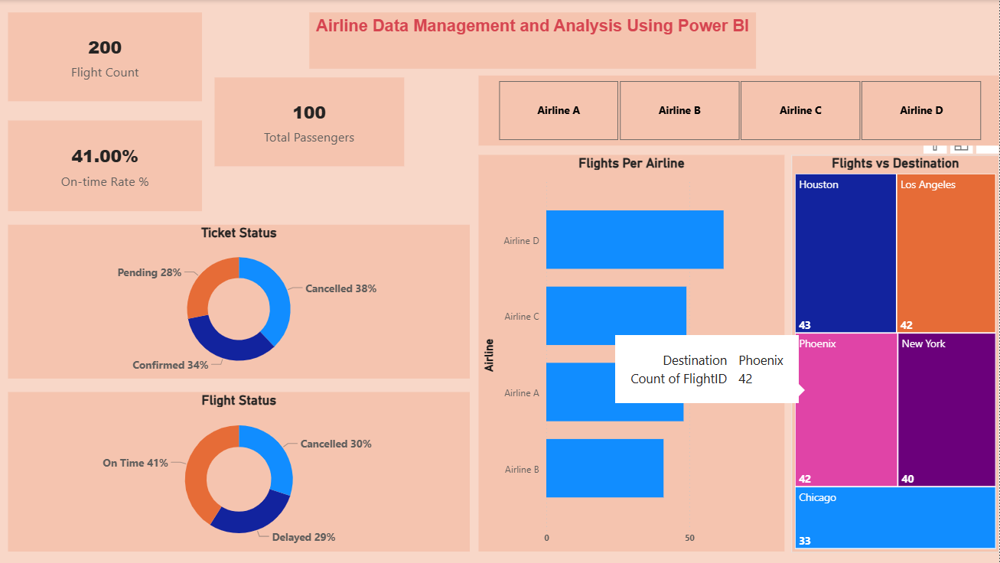
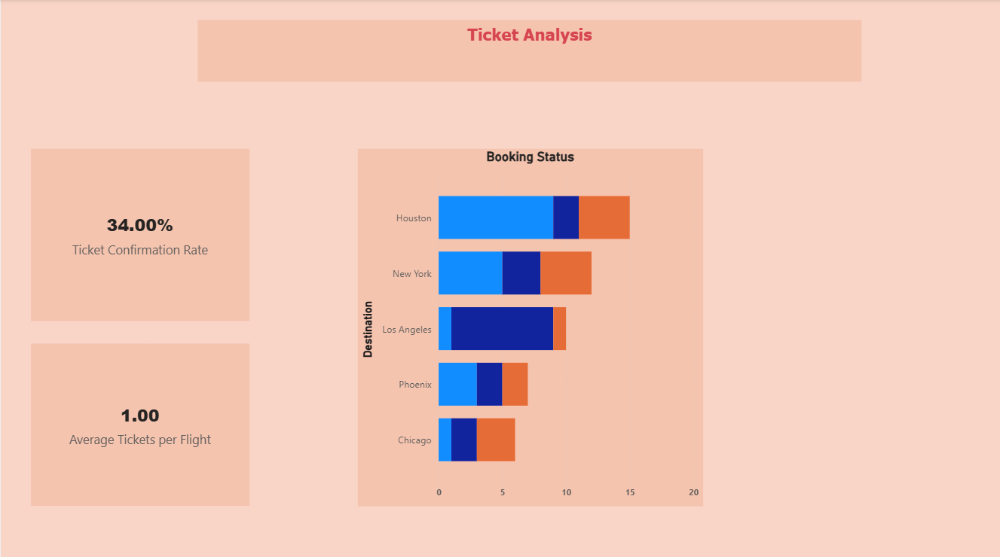
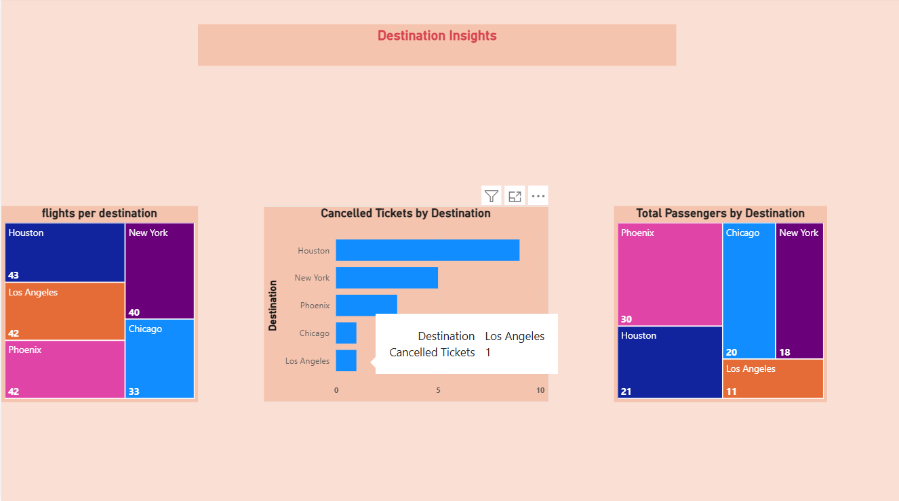
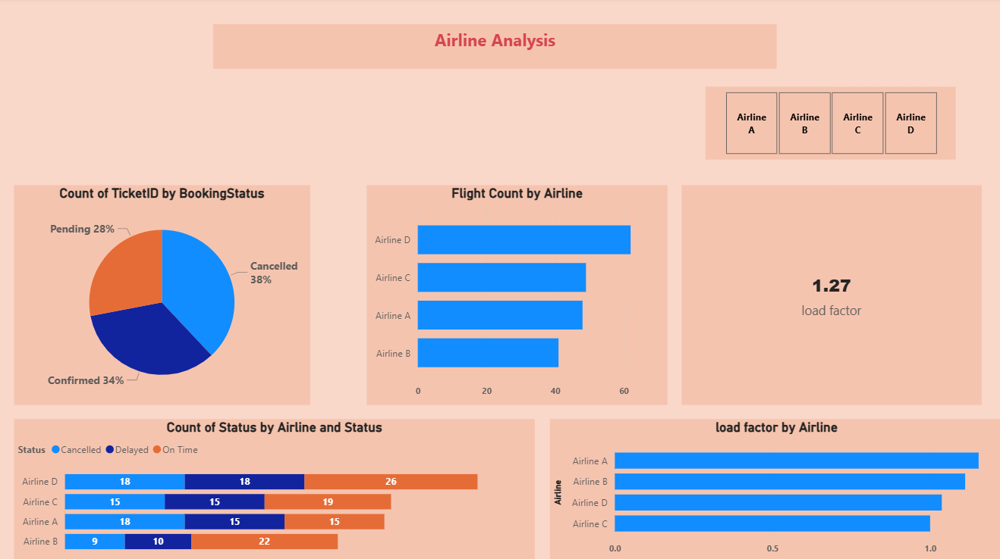

# Airline Operations Data Analysis and Dashboarding using Power BI   

## 🎯 Objective  
To analyze and visualize airline data for operational insights, passenger management, and ticket booking trends using Power BI. 

---

## 📑 Table of Contents  
 
- <a href="#overview">Overview</a>
- <a href="#business-problem">Business Problem</a>
- <a href="#dataset">dataset-information</a>
- <a href="#tools--technologies">Tools & Technologies</a>
- <a href="#project-structure">Project Structure</a>
- <a href="#methods">Methods</a>
- <a href="#key insights">Key Insights</a>
- <a href="#how-to-run-this-project">How to Run This Project</a>
- <a href="#final-recommendations">Final Recommendations</a>
- <a href="#dashboard">Dashboard</a>
- <a href="#author--contact">Author & Contact</a>


---

<h2><a class="anchor" id="overview"></a>Overview</h2>

This project focuses on analyzing airline operations using Power BI to gain actionable business insights.  
The analysis is based on datasets covering flights, passengers, and ticket information. The data was cleaned and transformed in Power Query, modeled with relationships, and enriched with DAX calculations for advanced metrics.  

---

<h2><a class="anchor" id="business-problem"></a>Business Problem</h2>

The airline industry operates with numerous complexities, requiring effective data
management and insights into flight schedules,passenger details, and ticketing systems. This
project aims to analyze airline operations for improving efficiency and customer satisfaction.

---

<h2><a class="anchor" id="dataset"></a>Dataset</h2> 

The project uses the following datasets:  
- **Flight Information**: FlightID, FlightNumber, Airline, Destination, Status  
- **Passenger Information**: PassengerID, FlightID, SeatNumber  
- **Ticket Information**: TicketID, FlightID, BookingStatus  

---

<h2><a class="anchor" id="tools--technologies"></a>Tools & Technologies</h2>

- **Power BI Desktop**  
- **Power Query** (for data preparation & cleaning)  
- **DAX (Data Analysis Expressions)**  

---

<h2><a class="anchor" id="project-structure"></a>Project Structure</h2>

```

airline-data-analysis-powerbi/
│
├── README.md
├── report.pdf
├── PowerBI_File/
│   └── airline_dashboard.pbix
└── Dashboard_Screenshots/
    ├── main_dashboard.png
    ├── ticket_analysis.png
    ├── destination_insights.png
    └── airline_analysis_dashboard.png

```

---


<h2><a class="anchor" id="methods"></a>Methods</h2>

### 1. Data Preparation & Cleaning
- Used **Power Query** to clean datasets.  
- Removed duplicates and verified no missing values.  
- Ensured correct data types across all tables.  

### 2. Data Modeling
- Established **FlightID** as the primary key.  
- Built relationships: Flight → Passenger (1:M), Flight → Ticket (1:M).  

### 3. Data Transformation
- Categorized flights into **“Best”** and **“To Be Improved”**.  
- Extracted Flight Number using **Column from Examples**.  

### 4. Calculations (DAX)
- Created measures for:  
  - Total Passengers per Flight  
  - Total Tickets Booked  
  - Filtered views for “Best” flights  

### 5. Visualization & Interactivity
- Built charts for passenger count, ticket statuses, and flight destinations.  
- Added slicers for **Airline** and **Destination**.  
- Implemented **Quick Views** (parameter-based slicers).  
- Designed airline-specific **drill-through pages**.  

### 6. Dashboard & Power BI Service
- Designed a **comprehensive dashboard** combining all insights.  
- Configured **Row-Level Security (RLS)** for Airline A.  
- (Note: Data refresh scheduling not possible with free Power BI license).  

---

<h2><a class="anchor" id="key insights"></a>Key Insights</h2>

- **Airline Operations**: 200 flights, only 41% on time → major reliability issues.  
- **Passengers**: Airline A carried ~30% of total passengers; Airline B lowest.  
- **Ticket Status**: 38% cancelled, 34% confirmed, 28% pending → customer dissatisfaction.  
- **Flight Status**: 59% flights delayed/cancelled → operational inefficiency.  
- **Destinations**: Houston (43 flights) & Los Angeles (42) top destinations; Chicago (33) underserved.  
- **Passenger Load**: Very low (~1 ticket per flight), showing under-utilization.  

---

<h2><a class="anchor" id="how-to-run-this-project"></a>How to Run This Project</h2>

1. **Clone or Download the Repository**
   ```bash
   git clone https://github.com/yourusername/airline-data-analysis-powerbi.git

---

<h2><a class="anchor" id="final-recommendations"></a>Final Recommendations</h2>

- Improve **on-time performance** by addressing delays/cancellations.  
- Optimize **ticket booking platforms** to reduce pending & cancelled tickets.  
- Increase **flights to high-demand cities** (Houston, Los Angeles, Phoenix).  
- Reallocate resources to underserved destinations (Chicago).  
- Support weaker airlines (like Airline B) to balance competitiveness.  


---

<h2><a class="anchor" id="dashboard"></a>Dashboard</h2>

- **Main Dashboard**  
    

- **Ticket Analysis**  
    

- **Destination Insights**  
    

- **Airline Analysis Dashboard**  
    

---

<h2><a class="anchor" id="author--contact"></a>Author & Contact</h2>

**Name:** Abhishek Tandle  
**Email:** (mailto:abhishektandle1507@gmail.com)  
**LinkedIn:** (https://www.linkedin.com/in/abhishek-tandle-a10b70260)  
**GitHub:** (https://github.com/abhishekt1507)  
**Portfolio:** (https://abhi-shek.my.canva.site/hi-i-m-abhishek)  

---